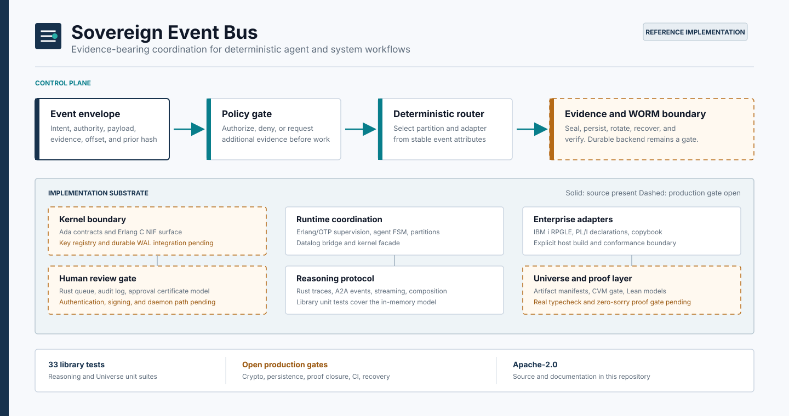

# Sovereign Event Bus



Sovereign Event Bus (SEB) is a multi-language reference implementation for
deterministic event coordination, policy-gated execution, human review, and
evidence-oriented delivery. The repository explores how an event can move from
an explicit authority envelope to an auditable outcome across Rust, Erlang,
Ada, Lean, and legacy enterprise adapters.

> [!IMPORTANT]
> SEB is under active hardening. It is not a production-ready event broker,
> cryptographic trust boundary, WORM store, or completed formal verification.
> The status tables below separate tested code from interfaces, prototypes, and
> open gates.

[Architecture](#architecture) | [Current status](#current-status) |
[Evaluate the code](#evaluate-the-code) | [Repository map](#repository-map) |
[BOB commands](#bob-commands) | [Production hardening](docs/PRODUCTION_HARDENING.md) |
[Developer guide](docs/DEVELOPER_GUIDE.md)

## Why this repository exists

SEB is organized around five engineering questions:

1. Can an event carry its intent, authority, evidence, and continuation state
   as one inspectable envelope?
2. Can routing and policy decisions be deterministic enough to reproduce?
3. Can native, managed, and legacy runtimes share a stable event contract?
4. Can high-impact transitions require an explicit human decision?
5. Can implementation evidence be connected to formal models without claiming
   more assurance than the evidence supports?

The codebase contains concrete experiments for each question. It does not yet
compose them into one deployable service.

## Current status

Status recorded on 2026-07-25 from the repository's default branch.

| Component | What is present | Current evidence | Open gate |
| --- | --- | --- | --- |
| Reasoning | Rust A2A events, traces, streaming buffers, and integration types | 18 library tests pass | The example target does not compile; transport, persistence, and real signatures are absent |
| Universe | Rust artifact manifests, indexes, search, and a compile-verify-merge model | 15 library tests pass | The example target does not compile; gate steps inspect metadata rather than invoking tools |
| Runtime | Erlang/OTP supervisors, agent FSM, partition manager, policy bridge, and kernel facade | Source and test modules are present | Runtime compile/test/release is not validated; the NIF and policy process are not operational |
| Kernel | Ada interfaces, an in-memory kernel body, WAL source, and a C NIF surface | Public interfaces and test-vector scaffolding are present | No portable build; persistence is disconnected; verification and key handling contain placeholders |
| Human review | Rust queue, audit log, and commit-gateway types | Workflow structure is present | The crate does not compile; authorization, durable storage, and gateway integration are incomplete |
| Lean verification | Lean models and proof attempts pinned to Lean 4.7.0 | Specifications are inspectable | The default build fails and proof files contain `sorry` or simplified cryptographic models |
| Enterprise adapters | RPG/ILE fiscal adapter, COBOL copybook, and PL/I declarations | Platform contracts and build notes are present | Not tested on IBM i or z/OS; wire layouts are not yet interoperable |
| Contracts and codegen | Rust, TypeScript, Python, Lean, and OpenAPI templates with shell generators | Templates are versioned | Generators are copy-oriented, output assumptions differ, and no conformance suite enforces parity |

The two passing Rust library suites are useful development baselines. They do
not constitute end-to-end, security, interoperability, or production evidence.

## Architecture

The intended event path is:

```text
producer
   |
   v
event envelope
   |
   v
authority and policy decision
   |
   v
deterministic routing
   |
   +----> bounded execution adapter
   |
   +----> human review when policy requires it
   |
   v
receipt, trace, and durable evidence
```

The repository implements these concerns in separate component experiments:

- `seb/contracts` defines candidate cross-language shapes.
- `seb/kernel` explores append, chain, offset, and segment interfaces.
- `seb/runtime` explores OTP supervision and per-agent coordination.
- `seb/reasoning` records reasoning-oriented A2A events and trace timelines.
- `seb/universe` indexes artifacts and models promotion gates.
- `seb/human_touch` models review and approval objects.
- `seb/verification/lean4` models selected invariants.
- `seb/adapters` documents legacy platform integration.

There is currently no executable that joins every box into one request path.
The canonical wire encoding, signature input, key authority, persistence
contract, and failure semantics must be unified before components can be
treated as one system.

## Evaluate the code

### Prerequisite

Install a Rust toolchain with Cargo. The repository has no root Cargo workspace,
so invoke each crate through its manifest.

```bash
git clone https://github.com/SNAPKITTYWEST/Sovereign-Event-Bus.git
cd Sovereign-Event-Bus

cargo test --manifest-path seb/reasoning/Cargo.toml --lib
cargo test --manifest-path seb/universe/Cargo.toml --lib
```

Expected baseline:

```text
seb/reasoning: 18 library tests pass
seb/universe:  15 library tests pass
```

Cargo will create local `target/` directories and may create crate-level lock
files. Build outputs are ignored by Git.

Do not use a successful library-only run to infer that examples or all targets
pass. These broader commands currently expose known integration failures:

```bash
cargo test --manifest-path seb/reasoning/Cargo.toml --all-targets --all-features
cargo test --manifest-path seb/universe/Cargo.toml --all-targets
cargo test --manifest-path seb/human_touch/Cargo.toml
```

The failures and ownership boundaries are cataloged in the
[developer guide](docs/DEVELOPER_GUIDE.md).

### Additional toolchains

Install only what is needed for the component being evaluated.

| Area | Required environment |
| --- | --- |
| Erlang runtime | Erlang/OTP and `rebar3` |
| Lean models | `elan`/Lean and `lake`; the project pins Lean and mathlib 4.7.0 |
| Ada kernel | GNAT/SPARK tooling, Erlang NIF headers, and the intended native crypto dependencies |
| Code generation | Bash, GNU Make, and Python 3; optional TypeScript and YAML validators |
| RPG adapter | IBM i with ILE RPG and DB2 objects described in the adapter guide |
| PL/I contract | z/OS Enterprise PL/I and site-specific JCL/link configuration |

Windows users should run shell tooling in a real Bash environment such as
Git Bash, MSYS2, or WSL. The scripts assume several GNU utilities and are not
PowerShell-native.

## Repository map

```text
.
|-- bob-shell/                    Development command wrappers
|-- docs/
|   |-- DEVELOPER_GUIDE.md       Build, test, and contribution workflows
|   |-- PRODUCTION_HARDENING.md  Readiness gates and operational criteria
|   `-- assets/                   Repository visuals
|-- seb/
|   |-- adapters/                RPG, copybook, and PL/I integration assets
|   |-- contracts/               Cross-language source templates
|   |-- human_touch/             Human-review Rust prototype
|   |-- kernel/                  Ada kernel and C Erlang NIF prototype
|   |-- reasoning/               Rust reasoning and trace library
|   |-- runtime/                 Erlang/OTP runtime prototype
|   |-- scripts/codegen/         Template expansion scripts
|   |-- universe/                Rust artifact-universe library
|   `-- verification/lean4/      Lean models and proof sources
|-- BOB_OPERATIONAL_CONTRACT.md
|-- BOB_TRUST_DEED_V1.md
`-- LICENSE
```

Layer numbers in historical documents are not fully consistent. This README
uses component names as the stable identifiers. References to an L0 master
specification or Idris implementation point to work that is not present in this
repository.

## Working with the components

### Reasoning

The reasoning crate exposes A2A event types, trace records, streaming support,
and integration structures from
[`seb/reasoning/src/lib.rs`](seb/reasoning/src/lib.rs).

```bash
cargo build --manifest-path seb/reasoning/Cargo.toml
cargo test --manifest-path seb/reasoning/Cargo.toml --lib
```

Trace storage and event streaming are process-memory structures. The current
signature field is not an Ed25519 implementation and must not be used as
authentication evidence.

### Universe

The universe crate exposes artifact manifests, an in-memory repository index,
and a model of compile-verify-merge gates from
[`seb/universe/src/lib.rs`](seb/universe/src/lib.rs).

```bash
cargo build --manifest-path seb/universe/Cargo.toml
cargo test --manifest-path seb/universe/Cargo.toml --lib
```

Gate steps currently validate metadata and simulated outcomes; they do not run
compilers, proof checkers, review services, or deployment systems.

### Erlang runtime

The intended local workflow is:

```bash
cd seb/runtime
rebar3 compile
rebar3 eunit
rebar3 dialyzer
```

These commands are targets to restore, not a passing baseline. The current
source has compile issues, the test functions are not discovered by EUnit, and
the Erlang facade does not load or match the C NIF interface.

### Lean verification

```bash
cd seb/verification/lean4
lake build
```

The project pins Lean 4.7.0 and mathlib 4.7.0. The default proof target
currently fails type checking, and several proof sources contain `sorry`.
Treat all proof certificates in the tree as historical development artifacts
until CI builds the declared theorem set with a zero-placeholder policy.

### Kernel and adapters

The Ada/C kernel and IBM adapter sources do not have a portable, tested build
entry point. Start with:

- [`seb/kernel/src/seb_kernel.ads`](seb/kernel/src/seb_kernel.ads) for the
  intended kernel API.
- [`seb/kernel/c/seb_kernel_nif.c`](seb/kernel/c/seb_kernel_nif.c) for the C NIF
  registry.
- [`seb/adapters/L4_ADAPTER_BUILD_GUIDE.md`](seb/adapters/L4_ADAPTER_BUILD_GUIDE.md)
  for target-platform assumptions.

Do not infer binary or wire compatibility from matching field names. Current
Ada, C test-vector, RPG, PL/I, Rust, Python, and TypeScript representations do
not yet share one validated canonical encoding.

## BOB commands

`bob-shell` contains development wrappers for common repository operations.
Invoke the scripts by filename from a Bash environment:

```bash
bash bob-shell/bob-build.sh
bash bob-shell/bob-test.sh
bash bob-shell/bob-audit.sh
bash bob-shell/bob-policy.sh
bash bob-shell/bob-proof.sh
bash bob-shell/bob-deploy.sh
```

| Command | Intended use | Important current behavior |
| --- | --- | --- |
| `bob-build.sh` | Dispatch component builds | Missing toolchains may be skipped; the report is not proof that every component built |
| `bob-test.sh` | Dispatch test suites | Deterministic mode sets environment variables but does not establish reproducibility by itself |
| `bob-audit.sh` | Produce file hashes and audit output | Requires GNU-style utilities; traversal, timestamps, and build files affect output |
| `bob-policy.sh` | Run a Prolog policy query | May create default governance files and executes a caller-supplied query |
| `bob-proof.sh` | Dispatch a proof backend | May create placeholder proof files; its generated certificate is not a production attestation |
| `bob-deploy.sh` | Package build output | Validation and sealing can be disabled; packaging is not deployment authorization |

These wrappers are operator conveniences, not a security boundary. Review their
working-tree mutations and generated reports before using them in automation.
See [`bob-shell/README.md`](bob-shell/README.md) and the
[developer guide](docs/DEVELOPER_GUIDE.md) for details.

## Failure modes to design for

The production plan treats the following as first-class scenarios:

| Scenario | Current behavior or risk |
| --- | --- |
| Process crash or restart | Several stores are in memory; recovery and replay are not demonstrated |
| Duplicate or replayed event | No shared nonce/idempotency store spans the components |
| Policy engine unavailable | The Erlang bridge can lack a live external process |
| Key compromise or rotation | No key authority, rotation protocol, revocation path, or historical-key policy is implemented |
| Partial append | WAL integration, atomic commit, and recovery evidence are incomplete |
| Partition rebalance | Current logic resets counters rather than transferring assignments |
| Human decision timeout | Durable queueing, escalation, authorization, and exactly-once commit are incomplete |
| Malformed or oversized envelope | A canonical encoding and cross-language conformance limits are not enforced |
| Short or non-ASCII identifiers | Some Rust diagnostic formatting uses fixed byte slices and can panic |
| Mixed-version deployment | There is no schema negotiation or compatibility matrix |

See [Production hardening](docs/PRODUCTION_HARDENING.md) for exit criteria,
required evidence, threat boundaries, release controls, and edge-case tests.

## Security and assurance

Until the hardening gates are complete:

- Do not expose SEB directly to untrusted networks.
- Do not use generated seals or certificates as legal, financial, or compliance
  evidence.
- Do not process secrets, regulated records, or irreversible production actions.
- Do not rely on BOB reports as attestations without independently validating
  their inputs and tool exits.
- Report non-sensitive defects through GitHub issues. Do not publish an
  undisclosed vulnerability before a private reporting channel is established.

The project needs an explicit security policy, supported-version policy, and
private disclosure route before a public production release.

## Development

The [developer guide](docs/DEVELOPER_GUIDE.md) covers:

- component-specific build and test commands;
- known failures and expected outputs;
- contract and wire-format ownership;
- generated files and cleanup;
- review requirements for security-sensitive changes; and
- the evidence required to change a status in this README.

Contributions should make the smallest coherent change, include tests at the
affected boundary, and update status claims only when a repeatable command or
artifact supports them.

## License

The repository is distributed under the
[Apache License 2.0](LICENSE). Some component metadata contains older license
labels; resolve those inconsistencies before packaging or redistributing an
affected component.
